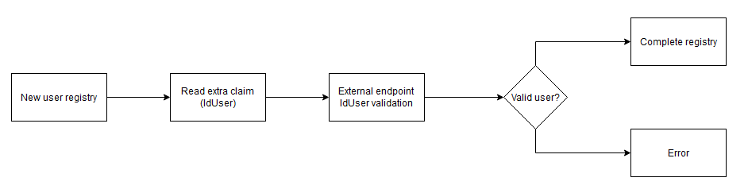

# Techical profiles

En este ejercicio vamos a desarrollar una `Custom Policy` con `Technical profiles` que nos permitirán comunicarnos con diferentes "actores"

_**Nota:** para este ejercicio partiremos de las politicas base del ejercicio anterior. Es importante haber completado los anteriores ejercicios y sus pasos._

## Creación de `Custom Policy` que valide usuario y realize proceso de registro

En este caso, vamos a utilizar la política base `B2C_1A_TrustFrameworkExtensions` y utilizaremos como plantilla inicial el fichero
`base.xml` de este ejercicio.

El escenario final es conseguir un flujo de registro algo mas complejo en el que previo a cualquier paso del registro se pedirá al usuario que introduzca un campo identificativo `IdUser`. Este campo será usado para validar el usuario contra un api externa (`ApiConnector`) y sólo si la validación es positiva se permitirá continuar con el proceso normal de registro



### Claims Transformation para obtener el cuerpo de la llamada REST
El primer paso es definir la transformación de claims que converirá el claim extension_userId a un JSON similar a:
```json
{
    "UserId": "valor"
}
```
1. Declaramos como `TransformationMethod` el valor `GenerateJson`
2. Creamos una sección de claims de entrada `InputClaims` con un único claim `extension_userId` e indicamos el mapeo con el parámetro del JSON de salida mediante el parámetro `TransformationClaimType` con valor `UserId`
3. Declaramos una sección de claims de salida `OutputClaims` con un único claim `validateUserIdBody` e indicamos el valor que espera este claim con el parámetro `TransformationClaimType` con valor `outputClaim`. El método de transformación `GenerateJson` expone el elemento de salida `outputClaim` que contiene el JSON en formato cadena (string)

### Technical profile que lea el identificador del usuario
Bajo el Technical Profile (en adelante TP) con identificador `ReadUserId`:
1. Todo TP requiere de un `DisplayName`, lo definimos con el valor deseado (Read User Id)
2. Declaramos el protocolo del TP, el cual indica que protocolo va a ser utilizado con la otra parte que nos comuniquemos. En este caso queremos interactuar con el usuario, por lo que declararemos un protocolo `Propietary + Self-asserted`. Sobre el parámetro `Protocol` declaramos los atributos:
  - Name: Correspondiente a un protocolo válido soportado por B2C para ser usado en la TP (OAuth2, SAML2, OpenIdConnect, Propietary o None). En este caso el valor es `Propietary`, indicando que no se va a usar un proveedor externo sino que se va a llamar al ensamblado .NET.
  - Handler: Al usar un protocolo `Propietary`, el parámetro handler especifica el nombre del ensamblado a utilizar. En este caso utilizamos el valor `Web.TPEngine.Providers.SelfAssertedAttributeProvider, Web.TPEngine, Version=1.0.0.0, Culture=neutral, PublicKeyToken=null`.
  - La sección Protocol ha que ser:

```xml
<Protocol Name="Proprietary" Handler="Web.TPEngine.Providers.SelfAssertedAttributeProvider, Web.TPEngine, Version=1.0.0.0, Culture=neutral, PublicKeyToken=null" />
```

3. Definimos los metadatos de la ventana bajo la sección `Metadata` mediante una lista de objetos/items:
  - Especificamos la interfaz de usuario definiendo un `ContentDefinitionReferenceId` con valor `api.selfasserted` (Utilizando la interfaz por defecto de B2C)
  - Ocultamos el botón cancelar ya que no queremos habilitar esta posibilidad mediante `setting.showCancelButton` con valor `false`
  - La sección `Metadata` ha de quedar:
  
```xml
  <Metadata>
      <Item Key="ContentDefinitionReferenceId">api.selfasserted</Item>
      <Item Key="setting.showCancelButton">false</Item>
  </Metadata>
```

4. Indicamos el contenido a mostrar dentro de la ventana mediante la sección `OutputClaims`:
  - Mostramos el mensaje de ayuda utilizando el claim `userId_required`
  - Colocamos el input para leer el UserId mediante el claim `extension_userId` (El tipo de control a mostrar lo se define en la declaración del claim)
  - La sección `OutputClaims` ha de ser:
  
```xml
  <OutputClaims>
      <OutputClaim ClaimTypeReferenceId="userId_required" />
      <OutputClaim ClaimTypeReferenceId="extension_userId" />
  </OutputClaims>
```

5. Declaramos la transformación de claims para generar el claim con el JSON válido para llamar a la validación del UserId mediante la sección `OutputClaimsTransformation` haciendo referencia a la transformación de claims definida al inicio del ejercicio `GenerateValidateUserIdBody`

6. Por último, dentro de las TP se puede gestionar el comportamiento ante un flujo de Single Sign On. Para ello Azure B2C dispone de distintos proveedores de sesión los cuales se pueden aplicar dentro de un TP mediante la sección `UseTechnicalProfileForSessionManagement`. En este caso buscamos que esta TP se ejecute siempre aunque ya se tenga una sesión iniciada (ya que el flujo es únicamente de registro), por lo que el valor de la sección será `SM-Noop` (el cual es un TP definido en los ficheros base que usa a su vez el proveedor `NoopSSOSessionProvider`) el cual fuerza que esta TP se ejecute siempre, independientemente de si existe o no una sesión activa.

### Technical Profile que haga una petición REST y valide el UserId
Existe una Azure Function bajo la ruta `https://b2cworkshopuseridvalidator.azurewebsites.net/api/Function1?code=tAS7CynrLodu3R__6WimYarBdxnfoasf5Zhnqulju5KTAzFuRexqcg==` que admite peticiones POST, lee el UserId proporcionado en el payload y devuelve una respuesta válida si el último carácter es numérico o erronea en caso contrario.
Bajo el Technical Profile (en adelante TP) con identificador `ValidateUserId`:

1. Añadir un `DisplayName` válido
2. Como sección de `Protocol`, usaremos un tipo `Propietary` con Handler `Web.TPEngine.Providers.RestfulProvider, Web.TPEngine, Version=1.0.0.0, Culture=neutral, PublicKeyToken=null`
3. Sobre la seccion `Metadata` añadiremos las siguientes claves:
  - ServiceUrl - Url al servicio con valor `https://b2cworkshopuseridvalidator.azurewebsites.net/api/Function1?code=tAS7CynrLodu3R__6WimYarBdxnfoasf5Zhnqulju5KTAzFuRexqcg==`
  - AuthenticationType - Tipo de autenticación con valor `Basic`
  - SendClaimsIn - Enviaremos el payload de la petición en el `Body`
  - AllowInsecureAuthInProduction - Con valor `false` ya que aplicamos una autenticación `Basic`
  - DefaultUserMessageIfRequestFailed - Añadimos un texto descriptivo a mostrar si la petición es erronea
  - ClaimUsedForRequestPayload - hacemos referencia al claim que contiene el payload en JSON usado en la transformación de claims `validateUserIdBody`
  - La sección de metadatos será:

```xml
<Metadata>
  <Item Key="ServiceUrl">https://b2cworkshopuseridvalidator.azurewebsites.net/api/Function1?code=tAS7CynrLodu3R__6WimYarBdxnfoasf5Zhnqulju5KTAzFuRexqcg==</Item>
  <Item Key="AuthenticationType">Basic</Item>
  <Item Key="SendClaimsIn">Body</Item>
  <Item Key="AllowInsecureAuthInProduction">false</Item>
  <Item Key="DefaultUserMessageIfRequestFailed">Cannot process your request right now, please try again later.</Item>
  <Item Key="ClaimUsedForRequestPayload">validateUserIdBody</Item>
</Metadata>
```

4. Al usar una autenticación del tipo `Basic`, es necesario proporcionar el usuario y password a utilizar. Estos valores se introducen desde el portal de Azure B2C, bajo la sección `PolicyKeys` de `IdentityExperienceFramework`. Una vez en esa sección:
  - Seleccionamos el botón `Add`
  - Como opciones de generación seleccionamos `Manual` para introducir el valor manualmente (con valor `admin`)
  - En `Name` introducimos `SigninWValidatorValidateUserIdUsername`, B2C añadirá el prefijo `B2C_1A_`
  - Mantenemos `KeyType` como `Secret`
  - Mantenemos `KeyUsage` como `Signature`
  - Click a `Create`
  - Repetir el mismo paso para crear `SigninWValidatorValidateUserIdPassword` con valor `admin`
5. De vuelta en la política, haremos referencia a las claves creadas dentro de la sección `CryptographicKeys` donde añadiremos dos claves:
  - BasicAuthenticationUsername - con valor `B2C_1A_SigninWValidatorValidateUserIdUsername`
  - BasicAuthenticationPassword - con valor `B2C_1A_SigninWValidatorValidateUserIdUsername`
  - La sección `CryptographicKeys` sera:

```xml
<CryptographicKeys>
  <Key Id="BasicAuthenticationUsername" StorageReferenceId="B2C_1A_SigninWValidatorValidateUserIdUsername" />
  <Key Id="BasicAuthenticationPassword" StorageReferenceId="B2C_1A_SigninWValidatorValidateUserIdPassword" />
</CryptographicKeys>
```

6. Como claims de entrada, haremos referencia al claim que contiene el payload en formato json `validateUserIdBody`
7. Como claim de salida recuperaremos si el UserId ha sido válido o no. En este caso tendremos que declarar como se realiza el mapeo entre la respuesta y los claims correspondientes:
- Indicamos que el claim de salida es `extension_isValidUser`
- Declaramos el mapeo de la respuesta mediante el atributo `PartnerClaimType` con el valor `isValidUser`
- La sección `OutputClaims` queda:
```xml
<OutputClaims>
  <OutputClaim ClaimTypeReferenceId="extension_isValidUser" PartnerClaimType="isValidUser" />
</OutputClaims>
```
8. Invalidamos el SSO con el uso de:
```xml
<UseTechnicalProfileForSessionManagement ReferenceId="SM-Noop" />
```

### Technical Profile que muestre pantalla de error
Bajo el Technical Profile (en adelante TP) con identificador `ShowValidationError`:
1. Añadir un `DisplayName` válido
2. Como sección de `Protocol`, usaremos un tipo `Propietary` con Handler `Web.TPEngine.Providers.SelfAssertedAttributeProvider, Web.TPEngine, Version=1.0.0.0, Culture=neutral, PublicKeyToken=null`
3. Como sección `Metadata`:
  - ContentDefinitionReferenceId - referenciamos la UI por defecto de B2C, `api.selfasserted`
  - setting.showContinueButton - false
  - setting.showCancelButton - false
4. Como claims de entrada declaramos únicamente `userId_validationError`
5. Declaramos este mismo claim como `DisplayClaim` para que sea mostrado al usuario ya que queremos informarle de este error
6. Invalidamos el SSO con el uso de:
```xml
<UseTechnicalProfileForSessionManagement ReferenceId="SM-Noop" />
```

### Ejecución de la política
1. Subir la política actualizando el nombre del archivo y de la política con las iniciales de cada usuario
2. Seleccionar la política en el listado de políticas de B2C
3. Validar que la aplicación seleccionada es la creada para el día 2 de pruebas
4. Click en `Run now`
5. Introducir un identificador de usuario acabado en letra y validar que se muestra la ventana de error
6. Lanzar nuevamente el flujo e introducir un identificador acabado en número
7. Validar que el flujo de registro continúa pidiendo los campos de registro y email
8. Finalizar el proceso de registro y validar el token devuelto